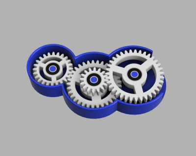
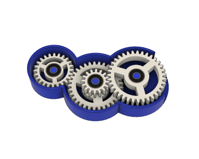

# Parametric Bearing Gear Toy (12/2018)

<table>
<tr>
<td></td>
<td></td>
</tr>
</table>

A parametric gear toy based on the [parametric spur gear](https://github.com/vsergeev/3d-gears/tree/master/parametric-spur-gear), using small bearings. The four gear teeth counts and bearing dimensions are adjustable parameters. The default settings yields a gear ratio of approximately 3 from the outside to inside gear, and uses MR104-2RS (4mm ID x 10mm OD x 4mm W) bearings. The bearings are press fit into the gear assemblies and onto the frame shafts.

**Design**: [Parametric Bearing Gear Toy v12.f3d](Parametric%20Bearing%20Gear%20Toy%20v12.f3d) (Fusion 360 Archive)

**Design**: https://a360.co/2EI4bxf (A360)

**STLs**:

  * [Frame.stl](stls/Frame.stl)
  * [Gear Assembly 1.stl](stls/Gear%20Assembly%201.stl)
  * [Gear Assembly 2.stl](stls/Gear%20Assembly%202.stl)
  * [Gear Assembly 3.stl](stls/Gear%20Assembly%203.stl)

**Recommended Print Settings:** 0.20mm layer height, 20% infill

**License**: 
