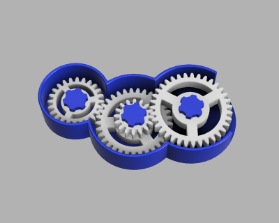

# Parametric Gear Toy (12/2018)

<table>
<tr>
<td></td>
<td></td>
</tr>
</table>

A parametric gear toy based on the [parametric spur gear](https://github.com/vsergeev/3d-gears/tree/master/parametric-spur-gear). The four gear teeth counts are adjustable parameters. The default settings yields a gear ratio of approximately 3 from the outside to inside gear.

**Design**: [Parametric Gear Toy v30.f3d](Parametric%20Gear%20Toy%20v30.f3d) (Fusion 360 Archive)

**Design**: https://a360.co/2QdHual (A360)

**STLs**:

  * [Frame.stl](stls/Frame.stl)
  * [Gear Assembly 1.stl](stls/Gear%20Assembly%201.stl)
  * [Gear Assembly 2.stl](stls/Gear%20Assembly%202.stl)
  * [Gear Assembly 3.stl](stls/Gear%20Assembly%203.stl)
  * [Shaft Bolt.stl](stls/Shaft%20Bolt.stl)

**Recommended Print Settings:** 0.20mm layer height, 20% infill

**License**: 
